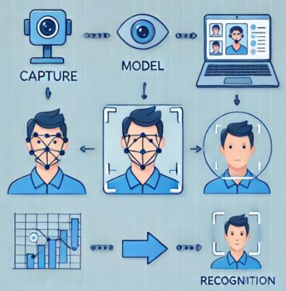
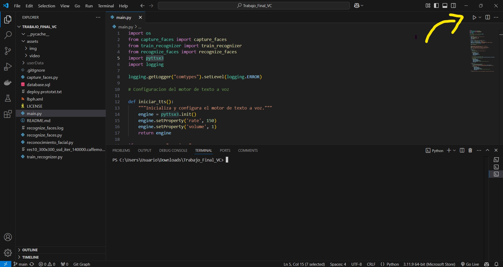
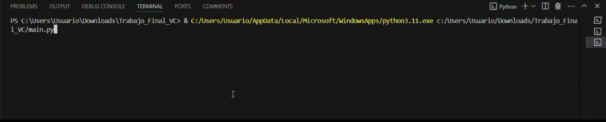
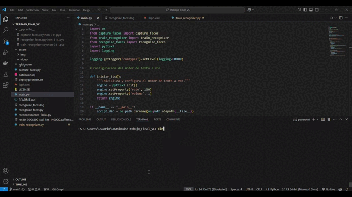
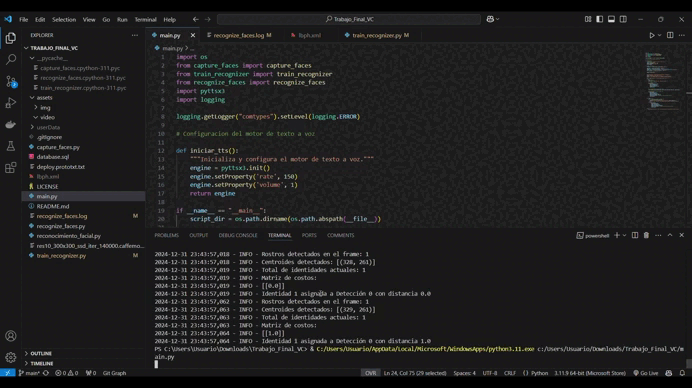
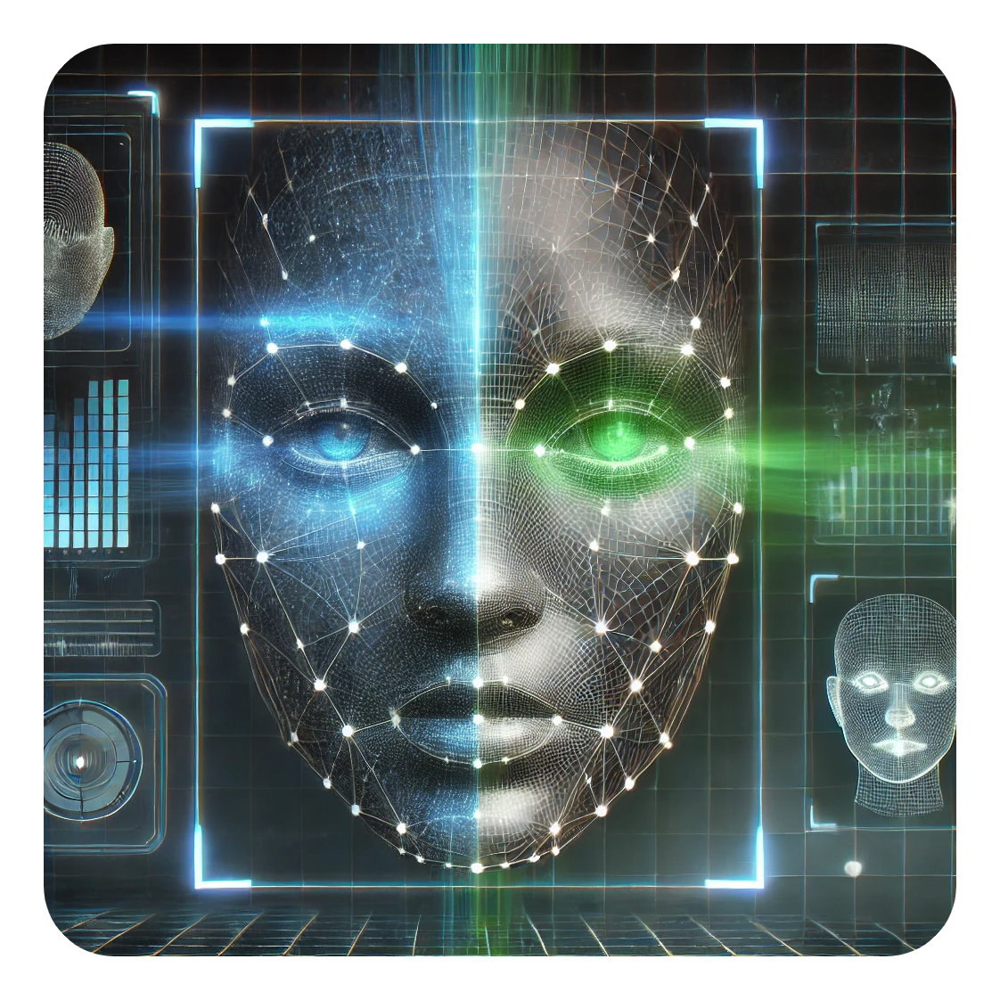

<h1 align="center">🤖Reconocimiento facial</h1>

Reconocimiento Facial. Consiste en aplicar distintas tecnicas de recocimiento facial para poder reconocer personas.

*Trabajo realizado por*:

[](https://github.com/kratoscordoba7)

[](https://github.com/AlejandroDavidArzolaSaavedra)

## 🛠️ Tecnologías Utilizadas

[](https://www.python.org/)
[](https://www.mysql.com/)

## 🛠️ Librerías Utilizadas

[](https://opencv.org/)
[](https://pypi.org/project/imutils/)
[](https://en.wikipedia.org/wiki/Operating_system)
[](https://numpy.org/)
[](https://docs.python.org/3/library/collections.html#collections.deque)
[](https://scipy.org/)
[](https://docs.python.org/3/library/logging.html)
[](https://pyttsx3.readthedocs.io/en/latest/)
[](https://deap.readthedocs.io/en/master/)

---

<h2>📋 Motivación/argumentación del trabajo</h2>

  
Nuestro trabajo se centra en el <b>reconocimiento facial</b>, una temática que nos despierta <b>curiosidad</b> 🧐 debido al funcionamiento y comportamiento de las <b>aplicaciones típicas nativas en dispositivos móviles</b> 📱 de la última década. 
<br><br>
Consideramos que el <b>reconocimiento facial</b> es un área <b>fascinante</b> ✨ que permite aplicar <b>técnicas y metodologías avanzadas de visión por computador</b> , ofreciendo una <b>oportunidad única</b> para explorar y desarrollar <b>soluciones innovadoras</b>. 💡
<br><br>

### Alcance y objetivo de la propuesta

Nuestro objetivo ha sido poder **reconocer personas** y **identificarlas**, ya sea de manera individual o en grupos, explorando distintas técnicas, librerías y tecnologías que nos permitieran investigar y probar hasta **dónde podíamos llegar**. 🔍💡 Durante el proceso, nos enfocamos en experimentar con diversas herramientas y enfoques, con la intención de maximizar el rendimiento y obtener resultados óptimos. 👩‍💻📊

### Uso/Controles 📖💻

Una vez tengamos todas las librerías instaladas, debemos dirigirnos al archivo `main.py` y ejecutarlo. Para ello, basta con hacer clic en el botón indicado en la imagen siguiente: 

<div align="center">
   
</div>

Al iniciar el programa, este nos dará la bienvenida y nos ofrecerá dos opciones para seleccionar. Estas opciones están diseñadas pensando en la flexibilidad del usuario:  

1️⃣ **Modo 1:** Capturar, entrenar y reconocer el rostro.  
2️⃣ **Modo 2:** Reconocer el rostro directamente, sin necesidad de un entrenamiento previo.  

Esta separación permite que el usuario pueda elegir lo que necesita sin tener que seguir pasos secuenciales innecesarios. Si solo deseas reconocer tu rostro sin haberlo entrenado antes, ¡no hay problema! Puedes seleccionar directamente el Modo 2.  

---

#### **Modo 1: Captura y Entrenamiento 🎥✨**

Si el usuario introduce "1", el programa solicitará un nombre que se utilizará para etiquetar correctamente el rostro durante el reconocimiento. Por ejemplo:  



Tras escribir el nombre, se abrirá una ventana con la cámara. En esta ventana, se indicará que al pulsar la tecla **"S"**, comenzará la captura del rostro. Para obtener mejores resultados en el reconocimiento, se recomienda:  

- Mirar directamente a la cámara.  
- Girar la cabeza suavemente hacia los lados.  

Aquí puedes ver un ejemplo del proceso:  

<div align="center">
   
</div>

#### **Modo 2: Reconocimiento Directo 🔍🤖**

Si el usuario introduce "2", el programa intentará reconocer el rostro directamente.  

- Si logra identificar el rostro, aparecerá etiquetado con el nombre previamente entrenado.  
- Si no logra identificarlo, el sistema mostrará la etiqueta **"Desconocido"**.  

Aquí tienes una demostración del funcionamiento:  

<div align="center">
   
</div>

Por otro lado, al ejecutar el archivo `genetic_algorithm.py`, se realizará el entrenamiento con los datos disponibles hasta el momento, con el objetivo de optimizar las ponderaciones asignadas a los algoritmos LBPH, Eigenfaces y Fisherfaces.

Los resultados del entrenamiento se guardarán en la base de datos. Posteriormente, al ejecutar nuevamente el archivo `main.py`, se utilizarán los datos almacenados en la base de datos, si están disponibles, para mejorar el rendimiento del sistema.

Se recomienda seguir los siguientes pasos para probar el sistema:  

1. Ejecutar `main.py` en el modo 1.  
2. Ejecutar `main.py` en el modo 2.  
3. Ejecutar `genetic_algorithm.py` para realizar el entrenamiento.  
4. Ejecutar nuevamente `main.py` en el modo 2, automáticamente usara los datos almacenados en la base de datos.

> [!IMPORTANT]  
> El modo 2 requiere que hayas ingresado al modo 1 al menos una vez; de lo contrario, no será posible ejecutarlo. Asimismo, para el entrenamiento con el algoritmo genético, se recomienda ejecutar el modo 1 previamente, ya que esto permite capturar los datos necesarios para un entrenamiento adecuado.


###  Descripción técnica del trabajo realizado

Se enfatizan los aspectos más relevantes del proyecto.

La clase FaceIdentity está diseñada para representar una identidad única de un rostro detectado en un sistema de seguimiento. Rastrear y gestionar la información de un rostro detectado, asociándolo con un identificador único y usando un tracker para realizar seguimiento entre frames.

```Python
class FaceIdentity:
    def __init__(self, face_id, initial_centroid, frames_to_confirm, initial_box, frame):
        """
        Inicializa una nueva identidad de rostro.

        :param face_id: Identificador único de la identidad.
        :param initial_centroid: Tupla (x, y) del centroide inicial del rostro.
        :param frames_to_confirm: Número de frames para confirmar la etiqueta.
        :param initial_box: Tupla (x, y, x1, y1) de la caja inicial del rostro.
        :param frame: Frame actual para inicializar el tracker.
        """
        self.id = face_id
        self.centroid = initial_centroid
        self.labels = deque(maxlen=frames_to_confirm)
        self.confirmed_label = None
        self.missing_frames = 0  # Contador de frames donde no se ha detectado el rostro
        self.tracker = cv2.TrackerCSRT_create()
        x, y, x1, y1 = initial_box
        w, h = x1 - x, y1 - y
        self.tracker.init(frame, (x, y, w, h))
        logging.info(f"Creada nueva identidad: ID {self.id} en centroid {self.centroid}")

```

El siguiente fragmento utiliza el algoritmo Húngaro para resolver la asociación entre las detecciones de rostros actuales y las identidades previamente rastreadas. Es crucial porque:

```Python
# Resolver la asignación óptima
row_ind, col_ind = linear_sum_assignment(cost_matrix)

# Asignar detecciones a identidades
for row, col in zip(row_ind, col_ind):
    distance = cost_matrix[row][col]
    if distance < max_distance:
        identities[row].centroid = detected_centroids[col]
        identities[row].missing_frames = 0
        assigned_identities.add(row)
        assigned_detections.add(col)
```

1. **Manejo de múltiples rostros**:
   - Al usar una matriz de costos (distancias entre centroides de las detecciones actuales y las identidades rastreadas), permite asociar de manera óptima los rostros detectados con sus correspondientes identidades en el menor costo posible.

2. **Rendimiento y precisión**:
   - Evita errores como asignaciones incorrectas o duplicadas mediante el cálculo preciso de distancias y la comparación con un umbral (`max_distance`).

3. **Escalabilidad**:
   - El enfoque permite que el sistema maneje múltiples rostros en tiempo real, algo fundamental en aplicaciones de reconocimiento facial.

4. **Prevención de errores**:
   - Si una detección no cumple con el criterio de distancia, no se asigna, reduciendo la probabilidad de errores en la identificación.


```Python
def preprocess_images(image_paths, scale_type):
    """
        Preprocesa las imágenes según el tipo de escala especificado.
        :param image_paths: Lista de rutas de imágenes.
        :param scale_type: Tipo de escala ('hsv', 'ycrcb', 'grayscale', 'noise_fourier').
        :return: Lista de imágenes preprocesadas.
    """
    preprocessed_images = []

    for path in image_paths:
        image = cv2.imread(path)

        if scale_type == 'grayscale':
            gray_image = cv2.cvtColor(image, cv2.COLOR_BGR2GRAY)
        elif scale_type == 'noise_fourier':
            gray_image = cv2.cvtColor(image, cv2.COLOR_BGR2GRAY)
            f = np.fft.fft2(gray_image)
            fshift = np.fft.fftshift(f)
            magnitude_spectrum = 20 * np.log(np.abs(fshift) + 1)
            gray_image = magnitude_spectrum.astype(np.uint8)
        else:
            raise ValueError("Tipo de escala desconocido: " + scale_type)

        preprocessed_images.append(gray_image)

    return preprocessed_images

def train_and_save_model(images, labels, model_type, output_path):
    """
        :param images: Lista de imágenes preprocesadas.
        :param output_path: Ruta donde se almacenará los embeddings .
    """
    if model_type == 'lbph':
        recognizer = cv2.face.LBPHFaceRecognizer_create()
    elif model_type == 'eigenfaces':
        recognizer = cv2.face.EigenFaceRecognizer_create()
    elif model_type == 'fisherfaces':
        recognizer = cv2.face.FisherFaceRecognizer_create()
    else:
        raise ValueError("Tipo de modelo desconocido: " + model_type)

    print(f"Entrenando embeddings {model_type}...")
    recognizer.train(images, np.array(labels))
    recognizer.write(output_path)
    print(f"Embeddings {model_type} guardado en: {output_path}")
```


El código del entrenamiento del reconocimiento facial se basa en utilizar tres técnicas diferentes: **LBPH (Local Binary Patterns Histograms)**, **Eigenfaces** y **Fisherfaces**. Aquí se explica el flujo de este código:

1. **Preprocesamiento de imágenes (`preprocess_images`)**:
    - **Entrada**: Recibe una lista de rutas de imágenes (`image_paths`) y un tipo de escala (`scale_type`), que puede ser `'grayscale'`, `'noise_fourier'`.
    - **Proceso**:
        - Para cada imagen en la lista, el código la lee usando `cv2.imread(path)`.
        - Si el tipo de escala es `'grayscale'`, convierte la imagen a escala de grises usando `cv2.cvtColor(image, cv2.COLOR_BGR2GRAY)`.
        - Si el tipo de escala es `'noise_fourier'`, primero convierte la imagen a escala de grises, luego aplica la Transformada Rápida de Fourier (FFT) para obtener la frecuencia de la imagen y genera un espectro de magnitudes que se utiliza como la imagen preprocesada.
        - Las imágenes preprocesadas se almacenan en una lista que luego se retorna.
    - **Salida**: Una lista de imágenes preprocesadas según el tipo de escala indicado.

2. **Entrenamiento:
    - **Entrada**: Recibe las imágenes preprocesadas, las etiquetas correspondientes, el tipo a entrenar (puede ser `'lbph'`, `'eigenfaces'` o `'fisherfaces'`).
    - **Proceso**:
        - Dependiendo del tipo seleccionado (`lbph`, `eigenfaces` o `fisherfaces`), se crea el respectivo reconocedor.

---

El objetivo del algoritmo genético es encontrar una combinación de pesos que optimice el rendimiento del sistema de reconocimiento facial. Se utiliza la librería `DEAP` para implementar este algoritmo.

- **Creación de individuos**:
  ```python
     creator.create("FitnessMax", base.Fitness, weights=(1.0,))
     creator.create("Individual", list, fitness=creator.FitnessMax)
  ```
  
- **Función de fitness**:
  La función `evaluate` se utiliza para evaluar el rendimiento con los pesos dados por un individuo. Este score se utiliza para evaluar qué tan bien el individuo realiza la tarea de reconocimiento facial:
  
  ```python
  def evaluate(individual):
      precision = simulate_model_with_weights(individual)
      return precision,
  ```

- **Simulación del modelo con pesos**:
  La función `simulate_model_with_weights` toma los pesos de un individuo y ajusta el comportamiento del sistema de reconocimiento facial. 

```python
def simulate_model_with_weights(individual):
    total_scores = []
    for _ in range(5):  # Procesar 5 frames para mayor robustez
        ret, frame = cap.read() 
        if not ret:
            logging.warning("No se pudo leer el frame de la cámara.")
            continue

        frame = cv2.resize(frame, (640, 480))
        h, w = frame.shape[:2]

        # Detectar el rostro
        blob = cv2.dnn.blobFromImage(
            frame, 
            scalefactor=1.0, 
            size=(300, 300), 
            mean=(104.0, 177.0, 123.0), 
            swapRB=False, 
            crop=False
        )
        net.setInput(blob)
        detections = net.forward()

        # Evaluamos cada detección
        for i in range(detections.shape[2]):
            confidence = detections[0, 0, i, 2]
            if confidence > 0.5:  # Umbral de confianza
                box = detections[0, 0, i, 3:7] * np.array([w, h, w, h])
                x, y, x1, y1 = box.astype("int")
                x, y = max(0, x), max(0, y)
                x1, y1 = min(w - 1, x1), min(h - 1, y1)
                rostro = frame[y:y1, x:x1]
                rostro_gray = cv2.cvtColor(rostro, cv2.COLOR_BGR2GRAY)
                rostro_resized = cv2.resize(rostro_gray, (150, 150), interpolation=cv2.INTER_CUBIC)

                lbph_result_HSV = face_recognizer_lbp.predict(rostro_resized)
                fisher_result_GRAY = face_recognizer_fisherfaces.predict(rostro_resized)
                eigen_result_FOURIER = face_recognizer_eigenfaces.predict(rostro_resized)

                # Aplicamos mayor peso a LBPH y menor peso a Fisherfaces y Eigenfaces, porque LBPH es más preciso
                confidences = [
                    lbph_result_HSV[1] / 100,
                    fisher_result_GRAY[1] / 50000,
                    eigen_result_FOURIER[1] / 50000
                ]

                # Combinamos resultados usando los pesos
                total_score = sum(w * c for w, c in zip(individual, confidences))
                total_scores.append(total_score)
    return sum(total_scores) / len(total_scores) if total_scores else 0.0
  ```
Se definen funciones para mutar y cruzar individuos de manera que los nuevos individuos resultantes también estén normalizados (es decir, la suma de sus pesos sea 1.0) y se inicializa la población, se define la probabilidad de cruce y mutación, y se ejecuta el algoritmo genético.

---

Al final, los pesos optimizados (**embeddings**) se almacenan en una base de datos MySQL.

Se establece una conexión a la base de datos y se ejecutan las sentencias SQL para crear la estructura necesaria:
  ```python
  db_connection = mysql.connector.connect(
      host="localhost", user="root", password="root", database="datadb"
  )
  ```

- **Guardado de los embeddings**:
  Después de obtener los mejores pesos del algoritmo genético, estos se guardan en la base de datos, convirtiéndolos a formato JSON para almacenarlos de forma eficiente:

```python
def guardar_embedding(nombre, lbph, eigenfaces, fisherfaces):
    delete_query = "DELETE FROM mi_tabla WHERE nombre = %s"
    cursor.execute(delete_query, (nombre,))
    db_connection.commit()

    lbph_json = json.dumps({"embedding": lbph})
    eigenfaces_json = json.dumps({"embedding": eigenfaces})
    fisherfaces_json = json.dumps({"embedding": fisherfaces})
    
    query = """
        INSERT INTO mi_tabla (nombre, lbph, eigenfaces, fisherfaces) 
        VALUES (%s, %s, %s, %s)
    """
    cursor.execute(query, (nombre, lbph_json, eigenfaces_json, fisherfaces_json))
    db_connection.commit()
    print(f"Embeddings guardados en la base de datos.")

  ```


### 📂 **Estructura del Proyecto**  

```
   📜 `main.py` Programa principal que coordina la ejecución del proyecto.  
   📸 `capture_faces.py` Script encargado de la captura de rostros utilizando SSD (Single Shot Detector).  
   🤖 `train_recognizer.py` Script que realiza el entrenamiento del modelo** para el reconocimiento facial.  
   🕵️ `recognize_faces.py` Script encargado del reconocimiento facial a partir de los datos entrenados.  
   📂 `userdata/`  Carpeta que almacena todos los rostros capturados** durante el proceso.  
```

Los demás archivos que encontrarás en el proyecto son autogenerados por el propio programa, o necesarios para el proceso de entrenamiento.

### Conclusiones y propuestas de ampliación, propuestas adicionales

La verdad es que hemos aprendido mucho sobre las técnicas implementadas y, a través de pruebas e investigación, logramos alcanzar el objetivo que nos habíamos propuesto inicialmente. Aunque algunas de estas técnicas las contemplábamos dentro del ámbito de la biometría de la asignatura, el hecho de probarlas y comprobar que realmente funcionan nos sorprendió gratamente.

- Una ampliación interesante, observando diversas páginas sobre reconocimiento facial, sería integrar el proyecto en una **Raspberry Pi**. La razón es que podría resultar muy útil aplicarlo en la entrada de una casa, donde la Raspberry Pi sería capaz de reconocer a la persona y abrir la puerta automáticamente. Además, podría encender las luces y realizar otras acciones dentro de la casa una vez haya reconocido al usuario.

- Otra aplicación potencial sería su integración en plataformas web, como aquellas utilizadas por la **tesorería** o sitios que requieren certificados como el DNI electrónico. Esto podría mejorar la seguridad, evitando la necesidad de introducir contraseñas o recibir códigos PIN, ya que el reconocimiento facial serviría como una forma de autenticación más rápida y segura.

- También sería interesante integrar esta tecnología en una **aplicación móvil** para el control de asistencia. Esta sería una medida adicional de seguridad, ya que permitiría verificar que la persona que pasa la asistencia es realmente quien dice ser, evitando que alguien pase la asistencia de otra persona utilizando solo sus credenciales. Esto ocurre con frecuencia en algunas universidades, donde se verifica la asistencia de manera digital, pero a menudo una persona pasa la asistencia de otro solo por compartir el código o las credenciales. Con esta aplicación, se podría requerir que el usuario se reconozca mediante reconocimiento facial y se tome una foto al momento de registrar su asistencia.


### Indicación de herramientas/tecnologías con las que les hubiera gustado contar / Aspectos a mejorar

Nos hubiera encantado contar con herramientas que pudieran integrar OpenCV con el desarrollo web de manera fácil, para mejorar la UI e incluso implementarlas en una aplicación web. Otras herramientas, como dlib, que generan muchos conflictos, también nos hubiera gustado probarlas. Vimos que tienen mucho potencial, pero no pudimos probarlas adecuadamente debido a problemas de incompatibilidades. Librerías como face_recognition requerían un alto consumo de recursos computacionales y funcionaban de manera bastante lenta. Dado que buscábamos una solución rápida, decidimos no optar por esta opción, aunque hubiera sido interesante probarla.

### Reuniones del grupo

Hemos tenido varias reuniones durante las clases prácticas, tanto con el profesor como con el propio equipo de desarrollo. Además, cada semana, o casi siempre, nos notificamos sobre el estado y avance del desarrollo de la aplicación.

### Créditos materiales no originales del grupo

Algunas imágenes utilizadas en el README y en el documento fueron generadas por DALL-E 3, y el video promocional fue desarrollado por Vidnoz.

### Entrenamiento

En cuanto al entrenamiento, utilizamos diferentes métodos como LBPH, Eigenfaces y Fisherfaces. Además, contamos con un proceso de entrenamiento que trabaja con un vector de descriptores, al cual le aplicamos un sumatorio y una ponderación en función de su desempeño. Estos descriptores son optimizados mediante algoritmos genéticos para acercarlos lo más posible a la solución ideal.  Tiene un comportamiento similar al de una neurona, es decir, estamos construyendo una función a partir de los descriptores, que permite que estos se comporten de manera que faciliten el reconocimiento facial.

La fórmula matemática es la siguiente:

$$
S(w_1, w_2, w_3, w_n..) = \sum_{i=1}^{n} \left( w_1 \cdot F_i(w) + w_2 \cdot E_i(w) + w_3 \cdot L_i(w) \cdot\cdot\cdot\right)
$$

Donde:

$$ 
S(w_1, w_2, w_3) 
$$ 

es el puntaje total ponderado.

$$ 
F_i(w) ), ( E_i(w) ), y ( L_i(w) 
$$ 

son los resultados de cada técnica (Fisherfaces, Eigenfaces y LBP) para el **i-ésimo** caso de prueba (por ejemplo, una imagen o un conjunto de características).

$$ 
w_1, w_2, w_3 
$$ 

son los **pesos** asignados por el algoritmo genético para cada técnica.

$$ 
n 
$$ 

es el número total de casos de prueba (pueden ser varias imágenes o muestras).

---

Algoritmo del Método Eigenfaces

1. **Cálculo de la media:**
   
$$
\mu = \frac{1}{n} \sum_{i=1}^n x_i
$$

2. **Cálculo de la matriz de covarianza \( S \):**
   
$$
S = \frac{1}{n} \sum_{i=1}^n (x_i - \mu)(x_i - \mu)^T
$$

3. **Cálculo de los autovalores \( \lambda_i \) y autovectores \( v_i \) de \( S \):**

$$
S v_i = \lambda_i v_i, \quad i = 1, 2, \dots, n
$$

4. **Ordenar los autovectores:**
  
5. **Proyección al subespacio PCA:**
   Las \( k \) componentes principales del vector observado \( z \) están dadas por:

$$
y = W^T (z - \mu)
$$
   
donde 

$$
   (W = [v_1, v_2, \dots, v_k] )
$$


---


El **LBP**  \((x_c, y_c)\) se calcula como:

$$
   LBP(x_c, y_c) = \sum_{p=0}^{P-1} 2^p \cdot s(i_p - i_c)
$$

Para cada pixel vecino, se compara su intensidad con la intensidad del pixel central 

$$
s(x) = 
\begin{cases} 
1 & \text{si } x \geq 0 \\
0 & \text{si } x < 0
\end{cases}
$$

---

La **función objetivo** de Eigenface:

Primero se calcula la **media de las imágenes** en el conjunto de entrenamiento y luego se calcula la **matriz de covarianza** entre todas las imágenes.

$$
   \mu = \frac{1}{N} \sum_{i=1}^{N} x_i
$$

$$
   C = \frac{1}{N} \sum_{i=1}^{N} (x_i - \mu)(x_i - \mu)^T
$$

Los **eigenvectores vi** y **eigenvalores** de la matriz de covarianza proporcionan la base del espacio de menor dimensión que describe mejor la variabilidad de los datos:

$$
C v_i = \lambda_i \cdot v_i \quad \text{para} \quad i = 1, 2, \ldots, n
$$

Las imágenes de entrada se proyectan sobre el espacio de los eigenfaces (componentes principales) para obtener una representación de baja dimensión

$$
E(w) = \text{Proyección de la imagen en el subespacio de Eigenfaces}
$$

El entrenamiento mediante algoritmos genéticos se lleva a cabo aplicando mutación, cruzamiento y selección utilizando la librería `deap`. Al ejecutar el archivo `genetic_algorithm.py`, se inicia el proceso descrito a continuación:


Se emplea la selección por torneo como método para elegir a los mejores individuos en cada generación. En este proceso, se otorga mayor importancia al modelo LBPH debido a que, durante la experimentación, se observó que este método ofrecía el mejor desempeño en términos de precisión.

En orden de relevancia, el segundo modelo con mejor comportamiento fue Eigenfaces, seguido por Fisherfaces, que mostró el rendimiento más bajo entre los tres. Por esta razón, el algoritmo da prioridad a los pesos asociados a LBPH, asignándoles una mayor influencia en el proceso de combinación de resultados.


---

## 📚 Fuentes y Tecnologías Utilizadas

1. **Documentación Oficial de OpenCV** [Enlace a la documentación](https://docs.opencv.org/)
2. **Tutorial sobre Reconocimiento Facial con OpenCV**  [Enlace al tutorial](https://docs.opencv.org/4.x/da/d60/tutorial_face_main.html#tutorial_face_eigenfaces)
3. **Introducción al Algoritmo Húngaro**  [Enlace al artículo](https://en.wikipedia.org/wiki/Hungarian_algorithm)
4. **Implementación de Algoritmos Genéticos en Python** [Enlace al blog](https://anderfernandez.com/blog/algoritmo-genetico-en-python/)
5. **Reconocimiento Facial con Python y OpenCV**  [Enlace al tutorial](https://omes-va.com/face-recognition-python/)
6. **Guía del Algoritmo Húngaro en Python**  [Enlace al artículo](https://python.plainenglish.io/hungarian-algorithm-introduction-python-implementation-93e7c0890e15)
7. **Universidad Michigan** [Enlace al pdf](https://web.eecs.umich.edu/~jjcorso/t/598F14/files/lecture_eigenfaces.pdf)
8. **Rasberry Pi Reconocimiento Facial** [Enlace al artículo](https://pyimagesearch.com/2018/06/25/raspberry-pi-face-recognition/)
9. **Face spoofing detection** [Enlace al artículo](https://link.springer.com/article/10.1007/s10044-020-00937-x) 

---

</a>


Tienen total libertad para utilizar el código. Espero que este repositorio haya sido de utilidad. Al final, queriamos ver qué lográbamos alcanzar con los recursos disponibles.

---
